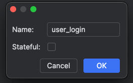
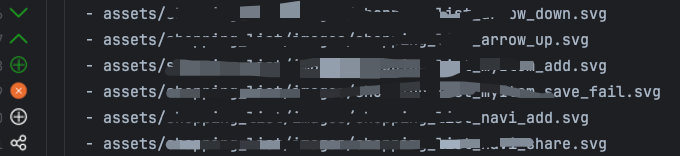
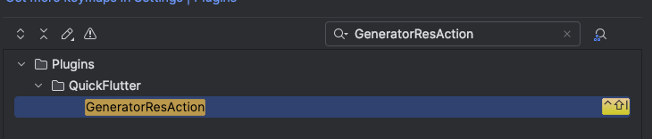
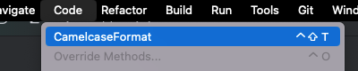

# 解决什么问题？

### 1. 快速创建 StatefulWidget、 StatelessWidget



```dart

import 'package:flutter/material.dart';

///
/// @date: 2024/08/22 20:54
/// @author: TangRen
/// @remark:
///

class UserLogin extends StatelessWidget {

  const UserLogin({super.key});

  @override
  Widget build(BuildContext context) {
    return Scaffold(appBar: AppBar(), body: Container());
  }  
}

```
### 2.左边栏预览图片、icon
支持预览：jpeg、png、webp、bmp、svg



#### 2.2 生成图片声明常量类



### 3.下划线分隔的蛇形命名快速转驼峰 cameCase
